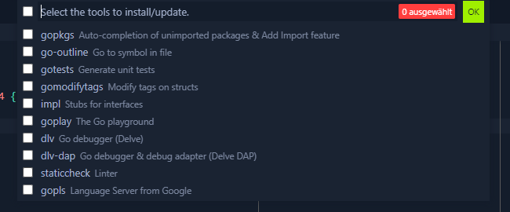
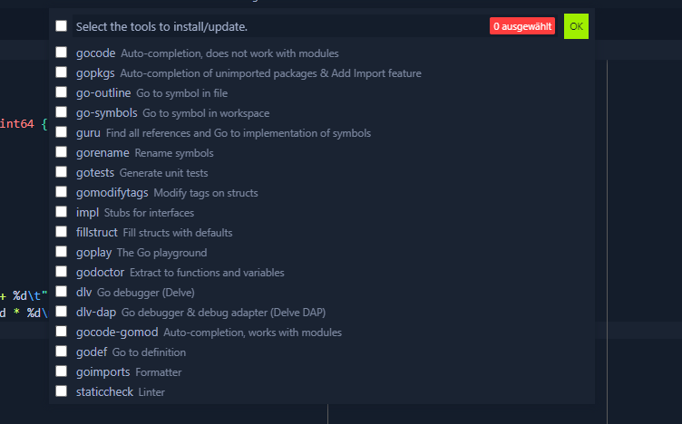

# GoLang Intellisense Fix for VSCode & Code OSS on Linux
This is a problem I encountered ony my ArchLinux system, using Code - OSS.

After installing [Code - OSS](https://github.com/microsoft/vscode) with the [official go extension](https://code.visualstudio.com/docs/languages/go) i found that i am not getting Intellisense at all when coding in go. After extensive research on this specific problem and also trying out neovim plugins which make use of gopls i couldnt find a solution.
Eventually I stumbled across a variable in the `settings.json` called `go.useLanguageServer` which is more or less (not responsible but) a fix for the problem. So here is my solution for the missing Intellisense in Code.

basically gopls is missing some tools for Intellisense(completions, hinting, formatting...), which by default the official go extension for vscode doesnt install. It installs some basic tools including the langage server (gopls) but not everything to make the Intellisense useful.

I found out that the `go.useLanguageServer` variable in `settings.json` triggers the installation prompt of vscode for the missing tools by setting it to `false`.
Then just run `ctrl+shift+p` to open the command prompt and use the `Go: Install/Update Tools` command to install all missing tools. Therefore simply select all tools and install them.

|go.useLanguageServer|bool|
|---|---|
||true|
||false|

Idk why but the problem is also somehow related to `module-mode` and `gopath-mode`, so on saving the go file in your current working directory in vscode, a problem will likely occur which needs you to create a go.mod file for your current project if it is not existing yet. Simply do a `go mod init` and completions should be working with `go.useLanguageServer` still set to `false`. Note that you wont get full Intellisense with the gopls server still set to false.

To enable the full Intellisense simply restart vscode and set the `go.useLanguageServer` variable in `settings.json` to `true`. Now just restart vscode again to ensure gopls is running and enjoy the working Intellisense. 
